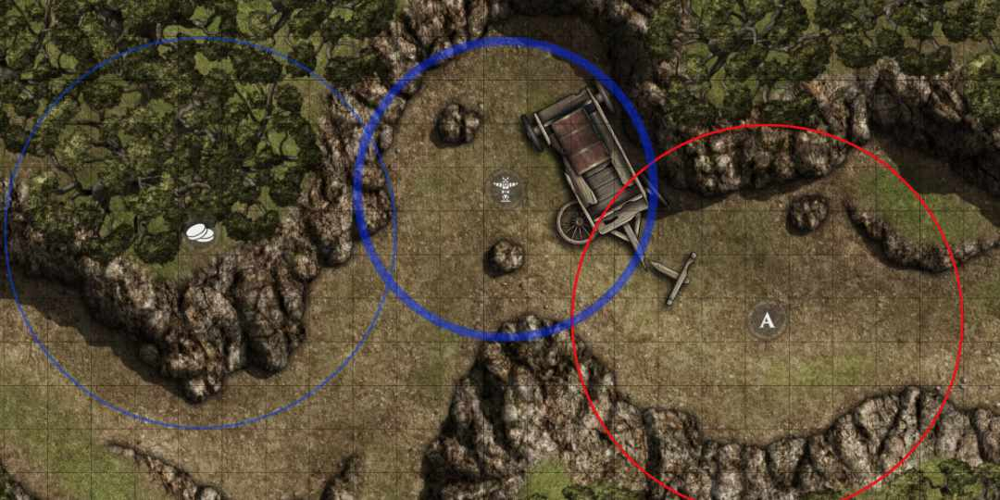
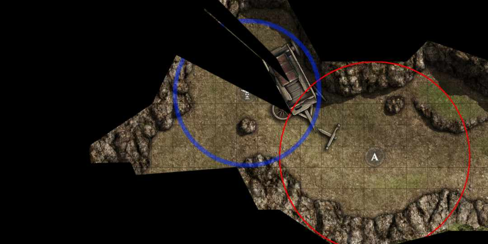
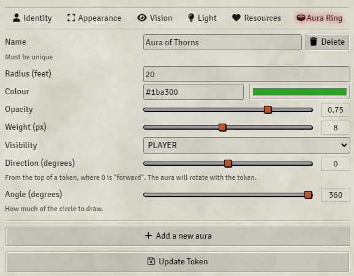

# Token Aura Ring

A simple module for Foundry VTT which adds outlined aura rings to a token.



Inspired by the [Token Auras](https://foundryvtt.com/packages/token-auras) add-on.

## About

This Foundry VTT module allows you to add and customise outlined aura rings around a token, ideal for cleanly representing the range of aura type effects without obscuring the map.

Aura rings are calculated as an emanation, based on the [Pathfinder 2nd Edition rules](https://2e.aonprd.com/Rules.aspx?ID=2387).

This means that the range of the aura ring is calculated from the edge of the token, instead of the centre.



Visibility of aura rings are obscured by fog-of-war, and hidden entirely when the viewing player is unable to see the token from which the aura rings are being emitted.

Hidden tokens will only show their aura rings to the game master.

## Installation

Either search for and install this module within Foundry VTT, or copy this address into the `Manifest URL` bar:

```
https://raw.githubusercontent.com/AnthonyEdmonds/token-aura-ring/main/module.json
```

## Usage

Once enabled, you can add and configure aura rings from the "Aura Ring" tab on any token settings page.



From there you can set the radius, colour, opacity, weight, and visibility of the aura ring.

You can add as many auras to a single token as you like by pressing the "Add a new aura" button at the bottom of the settings tab.

To remove an aura ring, set the radius to zero, the visibility to "NONE", or press the "Delete" button.

## Issues

This module may not work with game systems or addons which already implement their own token auras.

If you encounter any problems, raise a ticket on Github and I'll take a look.
