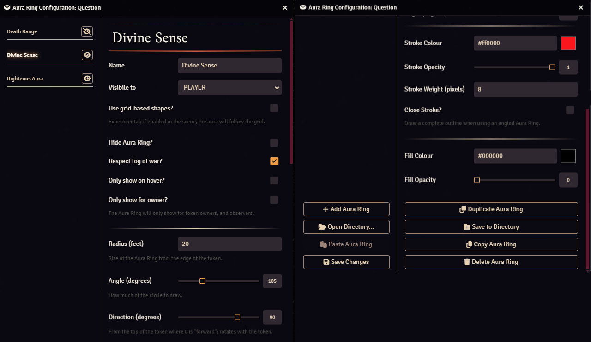

# Token Aura Ring

A simple module for Foundry VTT which adds outlined aura rings to a token.


## About

This Foundry VTT module allows you to add and customise aura rings emanated from a token, ideal for cleanly representing the range of aura type effects without obscuring the map.

Aura rings are calculated as an emanation, based on the [Pathfinder 2nd Edition rules](https://2e.aonprd.com/Rules.aspx?ID=2387). This means that the range of the aura ring is calculated from the edge of the token, instead of the centre.


Creatures larger than 1 tile will have flattened sides to correctly represent their aura range.

Visibility of aura rings are obscured by fog-of-war, and hidden entirely when the viewing player is unable to see the token from which the aura rings are being emitted.

Hidden tokens will only show their aura rings to the game master.

## What's the difference between this and Dynamic Token Rings?

Dynamic Token Rings, which is a Foundry VTT v12 feature, adds a ring directly around the edge of a token to represent resources, such as health or mana.

Token Aura Ring draws an arbitrary ring at any range from the token's edge.

## Installation

Either search for and install this module within Foundry VTT, or copy this address into the `Manifest URL` bar:

```
https://raw.githubusercontent.com/AnthonyEdmonds/token-aura-ring/main/module.json
```

## Usage

Once enabled, you can add and configure aura rings from the "Confgiure Token Aura Rings" button on the "Identity" tab of any token settings page (to avoid any confusion with dynamic token rings).



Settings are fully previewed, and are not stored until you press "Save Changes" and "Update Token".

### Stroke and fill

Aura rings may be drawn as an outline, a solid fill, or both.


The colour, opacity, and weight can be individually controlled, and strokes have the option of being "closed" if a complete outline is desired.

### Multiple aura rings

You can add up to 100 aura rings to a single token by pressing the "Add Aura Ring" button.

Press the "Duplicate Aura Ring" button to create an exact copy of the currently selected aura ring.

Press the "Delete Aura Ring" button to remove the currently selected aura ring.

### Visibility

You can control which user roles can see an aura ring using the "Visible to" setting.

You can also quickly show and hide an Aura Ring by pressing the "Eye" button or checking the "Hire Aura Ring" option.

Enabling the "Only show on hover?" option will cause the Aura Ring to only show when the token is hovered.

### Angled aura rings

You can adjust the "Direction" and "Angle" settings to create arcs instead of circles.


The "Angle" setting determines how much of the arc to draw.

The "Direction" setting rotates the arc around the token.

Arcs are drawn relative to the top of the token, where a direction of "0" is considered facing forward.

The arc is centralised around its direction, where an angle of "90" would have 45 degrees on either side.

When you rotate the token the arc will rotate with it.

Setting the "Angle" to "360" will draw a complete circle.

### Grid based aura rings

**This feature is experimental and under development**

Checking the "Use grid-based shapes" option will turn the aura ring from euclidean to grid-based, if the current scene has a grid enabled.


Tokens must be of a uniform size (1x1, 2x2, 3x3, etc) for this to work.

Hex grids are not currently supported.

### Negative radius

You may set the radius of an aura ring to a negative value to draw within the token's bounds.


This will only work with tokens which feature transparency, and is limited by the overall size of the token.

For example, a standard medium creature (1 square = 5 foot) can have a minimum radius of -2.49 feet.

## API

Module developers can control Aura Rings using the `AuraRingApi` class.

Macro developers can control Aura Rings using the `TokenAuraRing` global variable.

| Function  | Parameters                        | Returns          | Description |
|-----------|-----------------------------------|------------------|-------------|
| all       | TokenDocument                     | Array[AuraRing]  | Retrieve all Aura Rings |
| blank     |                                   | AuraRing         | Get an unsaved empty Aura Ring without an ID |
| delete    | TokenDocument, id                 |                  | Remove an Aura Ring |
| deleteAll | TokenDocument                     |                  | Remove all Aura Rings |
| get       | TokenDocument, term, field = 'id' | AuraRing\|false  | Retrieve a specific Aura Ring by a field, ID by default |
| index     | TokenDocument                     | Object{id: name} | Retrieve a list of Aura Ring names keyed by their ID |
| new       | TokenDocument                     | AuraRing         | Create a new Aura Ring from the default settings |
| set       | TokenDocument, AuraRing           |                  | Overwrite an Aura Ring with new settings |
| setAll    | TokenDocument, Array[AuraRing]    |                  | Overwrite all Aura Rings with a new set |
| setValue  | TokenDocument, id, key, value     |                  | Update a specific Aura Ring value directly |

All changes will trigger flag updates on the SimpleTokenDocument, and can be edited in the normal UI.

It is left up to the module developer to ensure that any set Aura Rings are valid.

### Macro example

This macro will list all of the Aura Rings on the selected token:

1. Create a new `script` macro
2. Paste the following:
   ```javascript
   console.log(
       TokenAuraRing.all(token.document),
   );
   ```
3. Select a token and run the macro to see a list of the Aura Rings on that token in the console

## Issues

This module may not work with game systems or addons which already implement their own token auras.

If you encounter any problems, raise a ticket on Github and I'll take a look.
