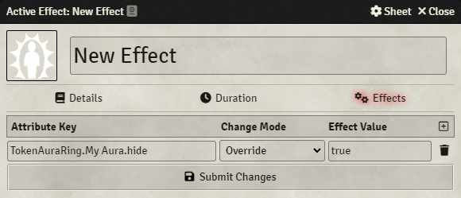
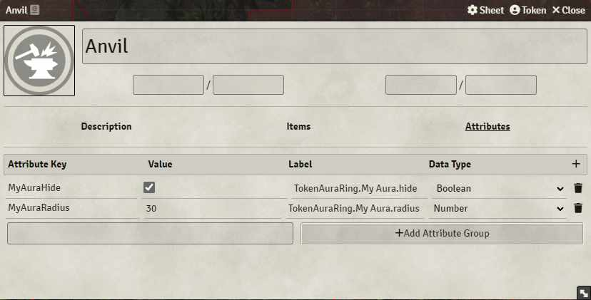

[< Back](../readme.md)

# Active Effects and Attributes

Where supported by the game system, Aura Rings on Tokens linked to an Actor can be controlled and modified using active effects and attributes.

Any field of an Aura Ring can be changed, with the most common usage being to show and hide Aura Rings based on a spell, item, or status.

Changes made in this way are non-destructive, and the original Aura Ring is preserved; changes will not show in the Aura Ring editor.

Changes made by active effects override any changes made by attributes.

The examples shown below will use `[square braces]` to indicate a placeholder.

For example, if your Aura Ring is named `Joe Bob` and you see `TokenAuraRing.[name]`, you would enter `TokenAuraRing.Joe Bob` without the square braces.

## Active Effects

Active effects are the preferred way of changing Aura Rings on the fly.

1. Create a new active effect
   * For example, in the 5e game system you might add it as a new Effect, or as part of an item or spell
   * This will vary by game system
2. Set the `Attribute Key` to `TokenAuraRing.[name].[field]`
   * For example, `TokenAuraRing.My Aura.hide` will change the `hide` property of the `My Aura` Aura Ring
   * All attributes must start with `TokenAuraRing.`
   * Aura Rings must be identified by their exact name, including spaces
   * The field must exist on the Aura Ring; refer to the [AuraRing object](../AuraRing.js) for valid fields and types
3. Set the `Change Mode`
   * `Override` and `Custom` will set the given value to the field
   * `Add` and `Upgrade` will add the given value to the field
   * `Multiply` will multiply the field's value by the given value
4. Set the `Effect Value`
   * For example, to hide an Aura Ring type `true`; to show it, type `false`
   * Do not use quotation marks when entering the value
   * Boolean fields, such as `hide` should be entered as `true` or `false`
   * Numeric fields, such as `radius`, should be entered as numbers
5. Submit your changes

Now when you toggle the active effect on and off, your Aura Ring should respond to the changes.

## Attributes

Attributes cannot take advantage of change modes, however they do provide a simple means to set static values on Aura Rings.

1. Add a new attribute to the Actor
   * For example, in the Simple World-Building game system these are found under the `Attributes` heading on any Actor
2. Set the `Attribute Key` to any value which is easy to remember
   * The `Attribute Key` is not used, so the value can be anything you like
3. Set the `Label` to `TokenAuraRing.[name].[field]`
   * As per #2 in the Active Effects section
4. Set the `Data Type`
   * Pick the type which matches the field you are changing
   * Do not use the `Resource` or `Formula` data types
   * Refer to the [AuraRing object](../AuraRing.js) for valid fields and types
5. Set the `Value`
   * For example, to hide an Aura Ring check the box; to show it, uncheck the box
   * Do not use quotation marks when entering the value
   * Boolean fields, such as `hide` should be entered as `true` or `false`
   * Numeric fields, such as `radius`, should be entered as numbers

The Aura Ring should respond to your changes as you enter them.
