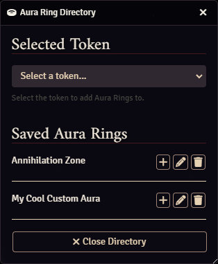

[< Back](../readme.md)

# Directory

A global Aura Ring Directory is provided to allow for defining Aura Rings for use across many tokens.

## Opening the Directory

A button to open the Aura Ring Directory is provided in the main "Configure Settings" and on Aura Ring Configuration screens.

You can also open the Directory using a macro, which is provided in the `API` section.

## Applying Aura Rings

You can pick which token to add Aura Rings to from the dropdown, which lists all tokens in the current scene.

If the Directory was opened from an Aura Ring Configuration screen, the current token preview will be automatically selected.

Pressing the "Add" button will copy the Aura Ring from the directory onto the selected token.

You can also rename and remove any Aura Rings from the directory.

## Library Management

To overwrite an existing Aura Ring, save an Aura Ring with the same name.

You will be prompted to change the name, in case you did not intend to overwrite an existing Aura Ring.

Pressing the "Remove" button will immediately delete that Aura Ring from the Directory.
