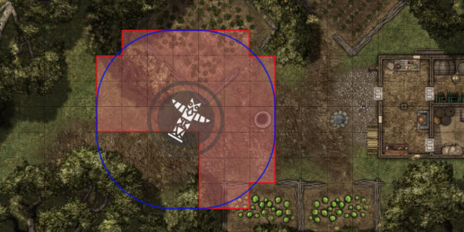
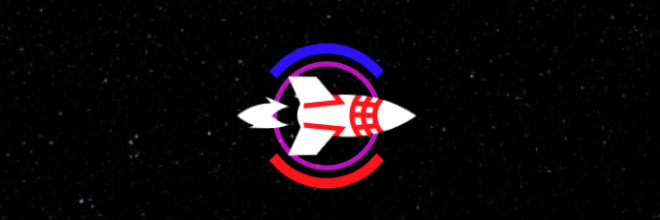

[< Back](../readme.md)

# Usage

Once enabled, you can add and configure aura rings from the "Confgiure Token Aura Rings" button on the "Identity" tab of any token settings page (to avoid any confusion with dynamic token rings).

Settings are fully previewed, and are not stored until you press "Save Changes" and "Update Token".

* Press "Add Aura Ring" to create a new blank Aura Ring
* Press "Open Directory..." to view your stored Aura Rings
* Press "Paste Aura Ring" on any Token to paste from the clipboard
* Press "Save Changes" to save your Aura Rings
* Press "Duplicate Aura Ring" to duplicate the current Aura Ring on the same Token
* Press "Save to Directory" to store the current Aura Ring in the Directory
* Press "Copy Aura Ring" to copy the current Aura Ring to the clipboard
* Press "Delete Aura Ring" to delete the current Aura Ring

## Stroke and fill

Aura rings may be drawn as an outline, a solid fill, or both.

The colour, opacity, and weight can be individually controlled, and strokes have the option of being "closed" if a complete outline is desired.

## Multiple aura rings

You can add up to 100 aura rings to a single token by pressing the "Add Aura Ring" button.

Press the "Duplicate Aura Ring" button to create an exact copy of the currently selected aura ring.

Press the "Delete Aura Ring" button to remove the currently selected aura ring.

## Visibility

You can control which user roles can see an aura ring using the "Visible to" setting.

You can also quickly show and hide an Aura Ring by pressing the "Eye" button or checking the "Hire Aura Ring?" option.

Enabling the "Only show on hover?" option will cause the Aura Ring to only show when the token is hovered.

Enabling the "Only show to owner?" option will cause the Aura Ring to only show for the token owner and observer, which includes the Game Master.

Disabling "Respect fog of war?" will cause the Aura Ring to be visible even when the player cannot see the eminating token.

## Angled aura rings

You can adjust the "Direction" and "Angle" settings to create arcs instead of circles.

The "Angle" setting determines how much of the arc to draw.

The "Direction" setting rotates the arc around the token.

Arcs are drawn relative to the top of the token, where a direction of "0" is considered facing forward.

The arc is centralised around its direction, where an angle of "90" would have 45 degrees on either side.

When you rotate the token the arc will rotate with it.

Setting the "Angle" to "360" will draw a complete circle.

## Grid based aura rings

**This feature is experimental and under development**

Checking the "Use grid-based shapes" option will turn the aura ring from euclidean to grid-based, if the current scene has a grid enabled.

Tokens must be of a uniform size (1x1, 2x2, 3x3, etc) for this to work.

Hex grids are not currently supported.

## Negative radius

You may set the radius of an aura ring to a negative value to draw within the token's bounds.

This will only work with tokens which feature transparency, and is limited by the overall size of the token.

For example, a standard medium creature (1 square = 5 foot) can have a minimum radius of -2.49 feet.
